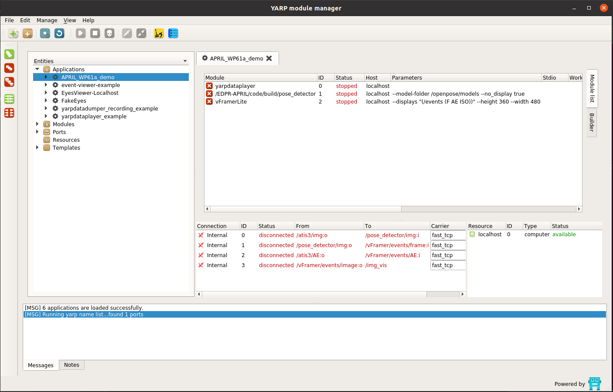
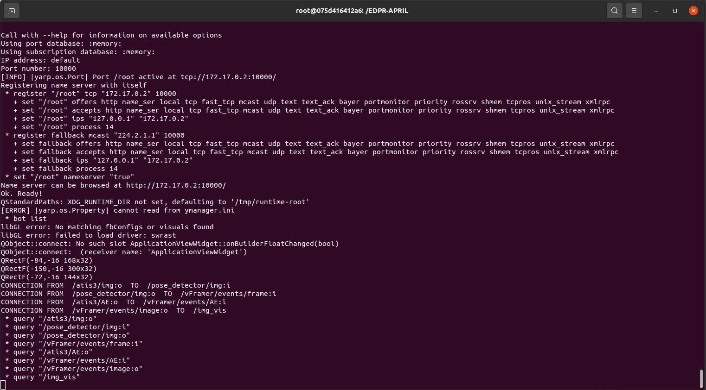
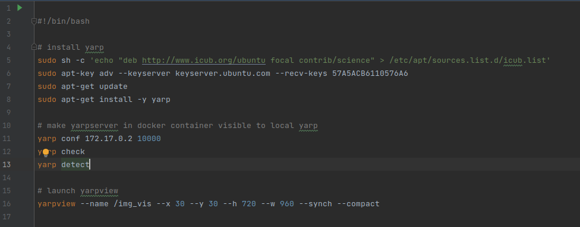
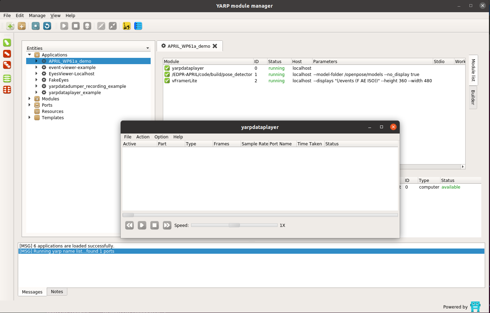
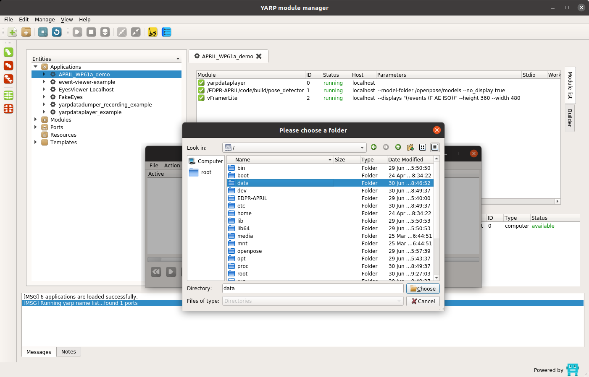
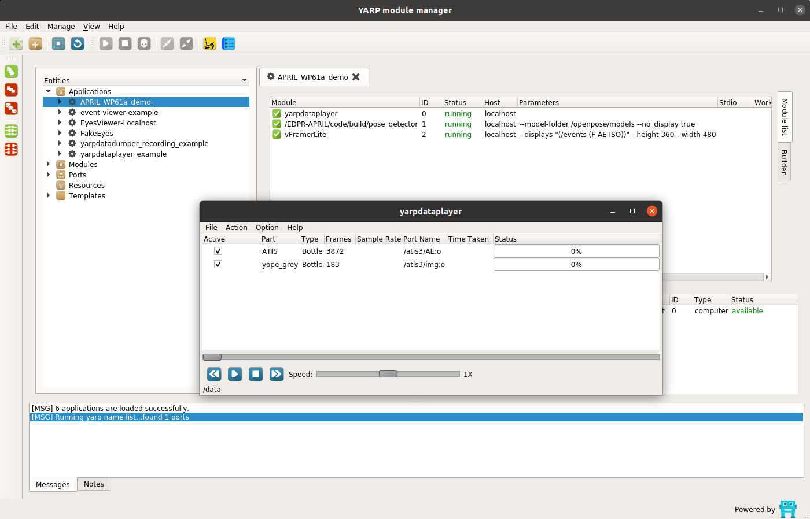
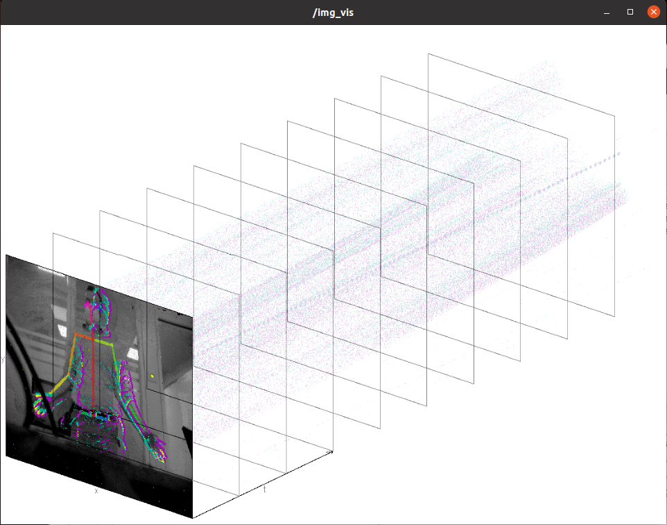

# EDPR-APRIL
EDPR repository for the European project [APRIL](http://aprilproject.eu/).

## Installation
The software was tested on Ubuntu 20.04.2 LTS with an Nvidia GPU.

- Install the latest [Nvidia driver](https://github.com/NVIDIA/nvidia-docker/wiki/Frequently-Asked-Questions#how-do-i-install-the-nvidia-driver)
- Install [Docker Engine](https://docs.docker.com/engine/install/ubuntu)
- Install [Nvidia Docker Toolkit](https://docs.nvidia.com/datacenter/cloud-native/container-toolkit/install-guide.html#docker)
- Install [Yarp](https://www.yarp.it/git-master/install_yarp_linux.html)
- Download the repository and build the Docker image
    ```shell
    $ cd /path/to/repository/folder
    $ docker build -t <container_name> - < Dockerfile
    ```


## Usage
- Run the Docker container and, inside it, run ``yarpserver`` and ``yarpmanager``
    ```shell
    $ xhost +
    $ docker run -it -v /tmp/.X11-unix/:/tmp/.X11-unix -e DISPLAY=unix$DISPLAY --runtime=nvidia <image_id>
    $ ./launch_yarpmanager.sh
    ```
  The ``yarpmanager`` window will appear as shown in the figure below.
  
  The terminal window will show ``yarpserver``'s IP address (``172.17.0.2`` in the figure below). This might be needed 
  for the next step.
  

- Open script ``launch_yarpview.sh`` and check if line 11 has the correct IP address of ``yarpserver`` gathered previously (figure below).
  If not, set the correct one.
  
  
- Run ``yarpview`` on the local machine (not Docker container)
    ```shell
    $ ./launch_yarpview.sh
    ```
  The script will also download and install locally ``yarp``.
  
- In the ``yarpmanager`` window, open the application menu and select the app "APRIL_WP61a_demo". The list of app 
  components will be shown as in the figure above
 
- Run all components by clicking on the green button ``Run all```

_ ``yarpdataplayer``'s GUI will be shown (figure below)
  
  Select ``File->Open Directory`` and select folder ``data`` as shown in the figure below
  

- Two data sources will be used: the grayscale frames (``yope_grey``) and the raw events (``ATIS``)
  
  Select ``Options->Repeat`` and start playing the recorded data by clicking on the ``Play`` button.

- Finally, connect all components by clicking on the green button ``Connect all`` in ``yarpmanager``'s GUI

The previously opened ``yarpview`` should now show the raw events, the grayscale frame and the overlayed 2D skeleton, as
shown in the figure below.
