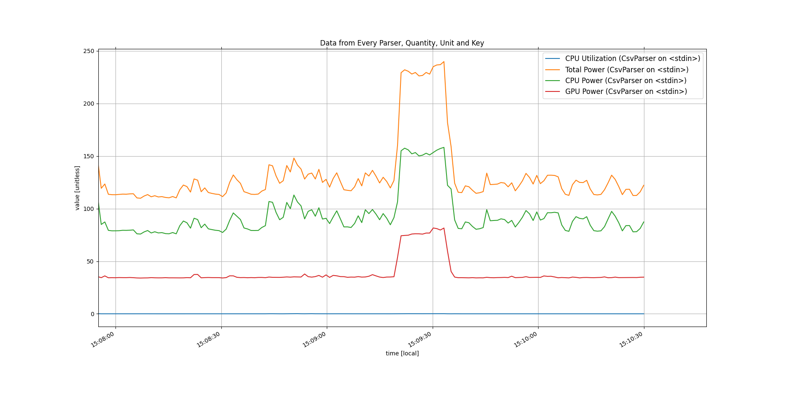

# Energy study for HPE
## Software used
- [powerjoular](https://github.com/joular/powerjoular) to get energy measurements from both CPU (based on `powercap`) and GPU (based on `nvidia-smi`). Installation guide is provided on github.
- [polt](https://pypi.org/project/polt/) to plot in real time the information saved using powerjoular. To install run:
```shell
python3 -m pip install --user polt
```

## Run the experiments
The results of powerjoular are saved to a `csv` file. In order to obtain an average result of the power consumption for an experiment, the script `totalpower.py` can be used.
Then to simplify the running process for the experiments, the following aliases can be added to '.bashrc':
```shell
alias pj="sudo rm -f power.csv && sudo powerjoular -tf power.csv && python3 totalpower.py"
alias plotpj=" (head -n1 power.csv; tail -fn0 power.csv) | polt add-source -p csv  live"
```
By running `pj` the measurements start and the data is logged in the file `power.csv` (powerjoular requires sudo). The results while running look like:
```shell
System info:
	Platform: intel
	Intel RAPL psys: TRUE
	Nvidia supported: TRUE
Total Power: 110.64 Watts (CPU: 75.89 W, GPU: 34.75 W)	\/ -5.29 Watts^C
```
By exiting (`ctrl+c`) the average result is displayed as
```shell
Average power =  108.61  W
```

On the other hand, to plot the results in real time the command `plotpj` must be run (while `pj` is still running). The plots look like:

